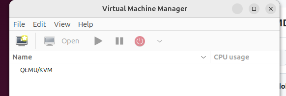
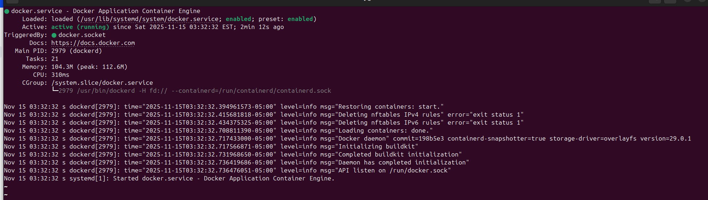
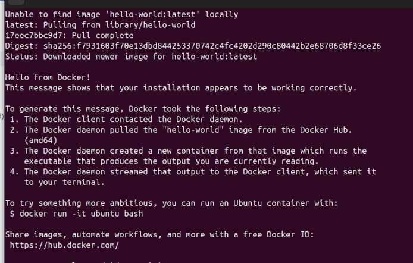

This project requires the Nvidia PhysicsNeMo API. 
It currently requires a docker installation, as this is the suggested way to use the PhysicsNemo API for most cases, according to their documentation.

Using the Ubuntu 24.04 installation described <a href="https://github.com/charlielobster/CUDA_NekRS.git">here</a>.

# Install PhysicsNeMo Prerequisites

The following steps are taken from the official docker installation docs <a href="https://docs.docker.com/desktop/setup/install/linux/">here</a>.

## Install kvm

On Ubuntu, Docker requires `kvm`

```
sudo apt update
sudo apt install qemu-kvm libvirt-daemon-system libvirt-clients bridge-utils virt-manager
reboot
```

After a reboot, the connection to `QEMU/KVM` should take. Check with a call to `virt-manager`:



## Install docker

From the <a href="https://docs.docker.com/engine/install/ubuntu/#install-using-the-repository">following</a> link, install docker via `apt`:

Add Docker's official GPG key:

```
sudo apt update
sudo apt install ca-certificates curl
sudo install -m 0755 -d /etc/apt/keyrings
sudo curl -fsSL https://download.docker.com/linux/ubuntu/gpg -o /etc/apt/keyrings/docker.asc
sudo chmod a+r /etc/apt/keyrings/docker.asc
```

Add the repository to `apt` sources:

```
sudo tee /etc/apt/sources.list.d/docker.sources <<EOF
Types: deb
URIs: https://download.docker.com/linux/ubuntu
Suites: $(. /etc/os-release && echo "${UBUNTU_CODENAME:-$VERSION_CODENAME}")
Components: stable
Signed-By: /etc/apt/keyrings/docker.asc
EOF
sudo apt update
```

Now install docker:

```
sudo apt install docker-ce docker-ce-cli containerd.io docker-buildx-plugin docker-compose-plugin
```

Check its status:

```
 sudo systemctl status docker
```




Check with a call to the hello world container:



## Install Nvidia Container Toolkit:

Taken from the official install docs <a href="https://docs.nvidia.com/datacenter/cloud-native/container-toolkit/latest/install-guide.html">here</a>.

Prerequisites:

```
sudo apt-get update && sudo apt-get install -y --no-install-recommends \
   curl \
   gnupg2
```

Configure the repository:

```
curl -fsSL https://nvidia.github.io/libnvidia-container/gpgkey | sudo gpg --dearmor -o /usr/share/keyrings/nvidia-container-toolkit-keyring.gpg \
  && curl -s -L https://nvidia.github.io/libnvidia-container/stable/deb/nvidia-container-toolkit.list | \
    sed 's#deb https://#deb [signed-by=/usr/share/keyrings/nvidia-container-toolkit-keyring.gpg] https://#g' | \
    sudo tee /etc/apt/sources.list.d/nvidia-container-toolkit.list
```
Optionally configure for experimental packages:

```
sudo sed -i -e '/experimental/ s/^#//g' /etc/apt/sources.list.d/nvidia-container-toolkit.list
```

Update apt-get and install:

```
sudo apt-get update
export NVIDIA_CONTAINER_TOOLKIT_VERSION=1.18.0-1
  sudo apt-get install -y \
      nvidia-container-toolkit=${NVIDIA_CONTAINER_TOOLKIT_VERSION} \
      nvidia-container-toolkit-base=${NVIDIA_CONTAINER_TOOLKIT_VERSION} \
      libnvidia-container-tools=${NVIDIA_CONTAINER_TOOLKIT_VERSION} \
      libnvidia-container1=${NVIDIA_CONTAINER_TOOLKIT_VERSION}
```


Configure the Docker Daemon to recognize the nvidia runtime. 

Add:

```
{
    "runtimes": {
        "nvidia": {
            "path": "nvidia-container-runtime",
            "runtimeArgs": []
        }
    }
}
```
In a new file called `daemon.json` in `/etc/docker`


# Load the PhysicsNeMo Docker Container: 

```
sudo docker run --gpus all --shm-size=1g --ulimit memlock=-1 --ulimit stack=67108864 --runtime nvidia --rm -it nvcr.io/nvidia/physicsnemo/physicsnemo:25.06 bash
```

You should see something like this:

